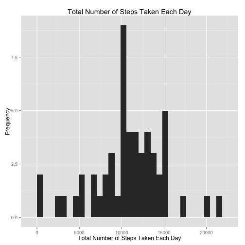
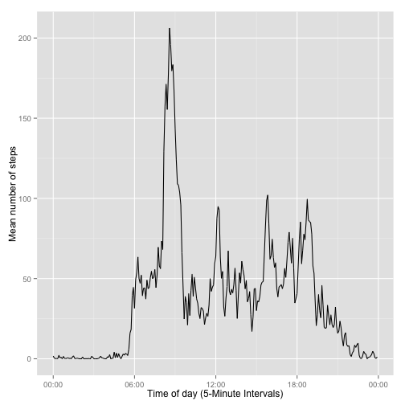
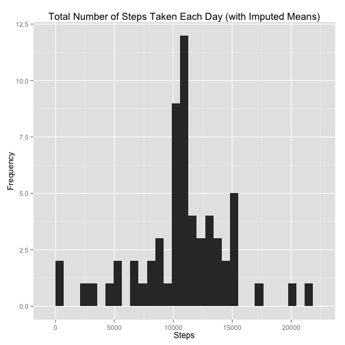
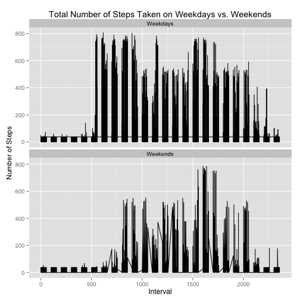

#Load potentially necessary packages

```r
require(RCurl);require(data.table);require(sqldf);require(RSQLite);require(jpeg);require(data.table);library(quantmod);require(ggplot2);library(scales);require(knitr)
```

```
## Loading required package: RCurl
## Loading required package: bitops
## Loading required package: data.table
## Loading required package: sqldf
## Loading required package: gsubfn
## Loading required package: proto
## Could not load tcltk.  Will use slower R code instead.
## Loading required package: RSQLite
## Loading required package: DBI
## Loading required package: jpeg
## Loading required package: xts
## Loading required package: zoo
## 
## Attaching package: 'zoo'
## 
## The following objects are masked from 'package:base':
## 
##     as.Date, as.Date.numeric
## 
## 
## Attaching package: 'xts'
## 
## The following object is masked from 'package:data.table':
## 
##     last
## 
## Loading required package: TTR
## Version 0.4-0 included new data defaults. See ?getSymbols.
## Loading required package: ggplot2
```

#Define destination of downloaded file, unzip, and then load data

```r
location <- getwd()
file <- "repdata-data-activity.zip"
file.path(location,file)
```

```
## [1] "/Users/ChannyNic/PeerAssessment1/repdata-data-activity.zip"
```

```r
download.file("https://d396qusza40orc.cloudfront.net/repdata%2Fdata%2Factivity.zip", file.path(location,file),method="curl")
activity<-read.csv(unzip(file.path(location,file), "activity.csv",list=FALSE),header=TRUE)
head(activity)
```

```
##   steps       date interval
## 1    NA 2012-10-01        0
## 2    NA 2012-10-01        5
## 3    NA 2012-10-01       10
## 4    NA 2012-10-01       15
## 5    NA 2012-10-01       20
## 6    NA 2012-10-01       25
```

```r
activity$steps<-as.numeric(activity$steps)
sapply(activity,class)
```

```
##     steps      date  interval 
## "numeric"  "factor" "integer"
```

#Create histogram of total number of steps taken per day

```r
qplot(tapply(activity$steps, activity$date, sum), xlab='Total Number of Steps Taken Each Day', ylab='Frequency',main="Total Number of Steps Taken Each Day")
```

```
## stat_bin: binwidth defaulted to range/30. Use 'binwidth = x' to adjust this.
```

 

#What is mean and median number of steps

```r
mean.steps<-mean(activity$steps,na.rm=TRUE)
median(activity$steps,na.rm=TRUE)
```

```
## [1] 0
```

#Create time series plot for average steps per day

```r
activity$date<-as.POSIXct(activity$date)
activity$time <- as.POSIXct(format(as.POSIXct(paste(activity$date, formatC(activity$interval / 100, 2, 										format='f')),format='%Y-%m-%d %H.%M', tz='GMT'),format='%H:%M:%S'),format='%H:%M:%S')
activity$mean.time<-tapply(activity$steps, activity$time, mean,na.rm=TRUE)
ggplot(activity, aes(time, mean.time)) + 
    		geom_line() + xlab('Time of day (5-Minute Intervals)') + ylab('Mean number of steps') + 
    		scale_x_datetime(labels=date_format(format='%H:%M'))
```

 

#What is interval with max steps and total number of missing values

```r
subset(activity,steps==max(activity$steps,na.rm=TRUE)) 
```

```
##       steps       date interval                time mean.time
## 16492   806 2012-11-27      615 2015-02-08 06:15:00  63.45283
```

```r
sum(is.na(activity))
```

```
## [1] 2304
```

```r
NA_activity<-activity
NA_activity[is.na(NA_activity)] <- mean.steps
```

#Make histogram of total steps per day with imputed means

```r
qplot(tapply(NA_activity$steps, activity$date, sum),xlab="Steps",main="Total Number of Steps Taken Each Day (with Imputed Means)",ylab='Frequency')
```

```
## stat_bin: binwidth defaulted to range/30. Use 'binwidth = x' to adjust this.
```

 

#What is mean and median of steps without missing values

```r
mean(NA_activity$steps,na.rm=TRUE)
```

```
## [1] 37.3826
```

```r
median(NA_activity$steps,na.rm=TRUE)
```

```
## [1] 0
```

#Difference between weekends and weekdays

```r
NA_activity$days <- factor(ifelse(weekdays(NA_activity$date) == c("Saturday","Sunday"), "Weekends", "Weekdays"))
```

#Plot comparing the average number of steps taken per 5-minute interval across weekdays and weekends

```r
plot1<-ggplot(NA_activity, aes(x = interval, y = steps, group = days)) +
        geom_line() +
        xlab(expression(paste("Interval"))) +
        ylab(expression(paste("Number of Steps")))+
        #scale_x_datetime(labels=date_format(format='%H:%M')+
        labs(title="Total Number of Steps Taken on Weekdays vs. Weekends") +
        facet_wrap( ~ days,ncol=1)
plot1
```

 


